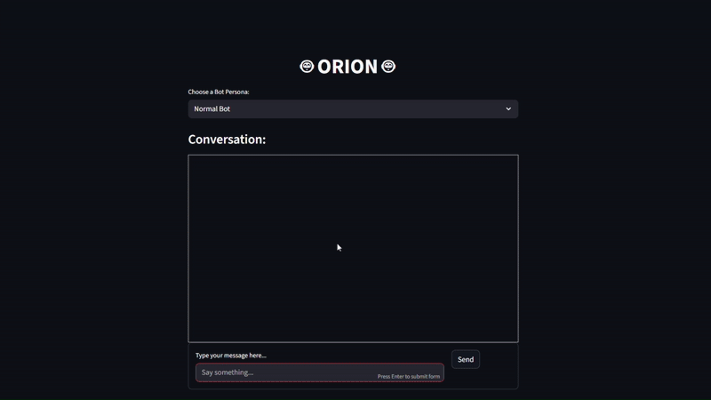

# 🤖 ORION - Streamlit Chatbot

[](https://www.python.org/)  
[](https://streamlit.io/)  
[](LICENSE)

**ORION** is an interactive, web-based chatbot built with **Streamlit**, **Hugging Face Mistral LLM**, and **LangChain memory**. It supports multiple personas for fun and creative conversations.

---

## Demo

  

Try it live locally:

```bash
streamlit run app.py

Features

Multiple Personas

Normal Bot – Standard conversational AI.

RoastBot – Witty, sarcastic, slightly savage responses.

ShakespeareBot – Shakespearean English replies.

EmojiBot – Emojis-only responses.

Persistent Memory – Conversation history is stored via LangChain for contextual replies.

Scrollable Chat UI – Easy-to-read interface with auto-scroll.

Installation
git clone https://github.com/yourusername/orion-chatbot.git
cd orion-chatbot
python -m venv venv
source venv/bin/activate  # Linux/Mac
venv\Scripts\activate     # Windows
pip install -r requirements.txt


Add your Hugging Face API token in orion.py:

st.session_state.client = InferenceClient(
    model="mistralai/Mistral-7B-Instruct-v0.2",
    token="YOUR_HUGGINGFACE_API_KEY"
)

Usage

Run the app:

streamlit run app.py


Open in your browser at http://localhost:8501.

Select a persona and type a message.

Enjoy ORION’s responses in real-time!

Project Structure
orion-chatbot/
│
├── orion.py                  # Main Streamlit app
├── requirements.txt        # Dependencies
├── README.md               # Project documentation
├── LICENSE                 # MIT License
└── assets/
    ├── demo.gif            # Example GIF of chat interaction
    └── screenshot.png      # Static screenshot

Customization

Model: Swap "mistralai/Mistral-7B-Instruct-v0.2" for any Hugging Face chat model.

Personas: Edit apply_persona() to add or modify bot behaviors.

Memory: Replace ConversationBufferMemory with other LangChain memory classes.

License

MIT License – see LICENSE
 for details.

Acknowledgements

Hugging Face
 – LLM models & inference

LangChain
 – Conversation memory

Streamlit

 – Interactive web app
