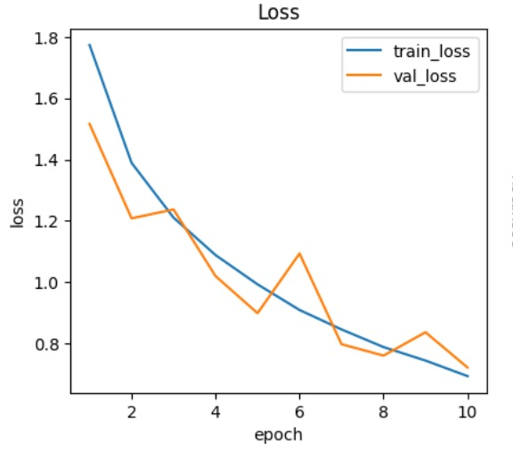

# CIFAR-10 Image Classification

This project implements and compares CNN models on the CIFAR-10 dataset using PyTorch. We explore training from scratch and fine-tuning a pretrained model, with and without data augmentation.

---

## Project Structure

```text
CIFAR10-Image-Classification/
│
├── README.md
├── notebook.ipynb
│
├── assets/
│   ├── tinyvgg_noaug_loss.png
│   ├── tinyvgg_noaug_acc.png
│   ├── tinyvgg_noaug_confusion.png
│
│   ├── tinyvgg_aug_loss.png
│   ├── tinyvgg_aug_acc.png
│   ├── tinyvgg_aug_confusion.png
│
│   ├── resnet18_noaug_loss.png
│   ├── resnet18_noaug_acc.png
│   ├── resnet18_noaug_confusion.png
│
│   ├── resnet18_aug_loss.png
│   ├── resnet18_aug_acc.png
│   └── resnet18_aug_confusion.png

```

---

## Models and Experiments

We trained four configurations:

| Model | Augmentation | Test Accuracy | Notes |
|-------|-------------|---------------|-------|
| TinyVGG (from scratch) | ❌ No | 0.79 | Baseline CNN trained from scratch |
| TinyVGG (from scratch) | ✅ Yes | 0.79 | Slight improvement with augmentation |
| ResNet18 (pretrained) | ❌ No | 0.81 | Pretrained model converges faster, slightly higher test accuracy |
| ResNet18 (pretrained) | ✅ Yes | 0.78 | Pretrained with augmentation, robust training |

---

## Loss and Accuracy Plots

### TinyVGG (No Augmentation)


### TinyVGG (With Augmentation)



### ResNet18 (No Augmentation)


### ResNet18 (With Augmentation)


---
## Key Insights

Traditional ML models underperform badly on raw image data; they lack capacity for complex features.

TinyVGG learns patterns but struggles without augmentation, showing clear gains when augmentations are applied.

ResNet-18 consistently outperforms TinyVGG, achieving the best accuracy in both no-aug and augmented settings.

Data augmentation provides significant improvements across CNNs, especially reducing overfitting and improving generalization.

---

## Observations

- Data augmentation slightly improves generalization, more noticeable in some classes.  
- Pretrained ResNet18 converges faster and learns more complex features than TinyVGG.  
- TinyVGG with augmentation shows stable performance despite being small.  
- Best performer: **ResNet18 (pretrained, no augmentation)** with 0.81 test accuracy.

---

## Conclusion

This project demonstrates the impact of model choice and data augmentation on CIFAR-10 classification


## Run in Google Colab

You can open and run this project in Google Colab here:  
[Open in Colab](https://colab.research.google.com/drive/1uMPY_mF4NyWrkpf6Vti9eNmWV_bh62eM?usp=sharing)


